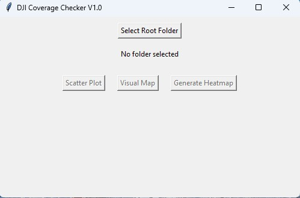
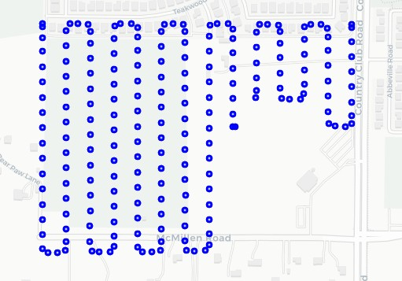
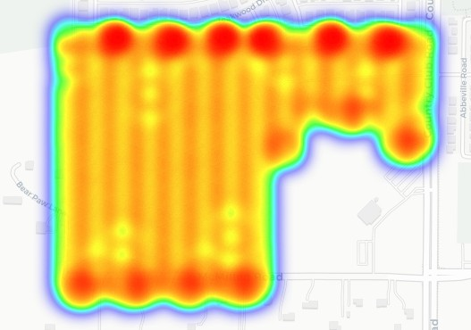
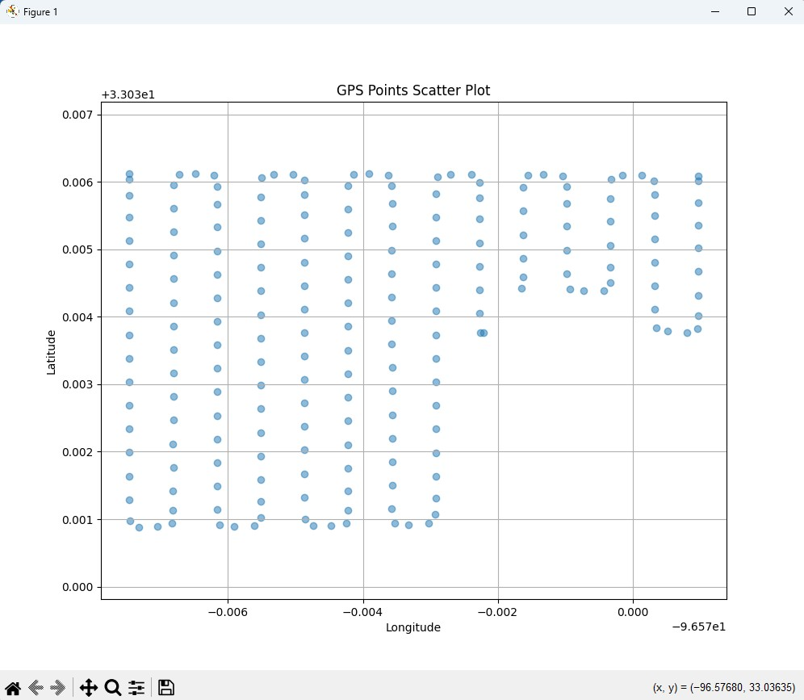

# DJI Coverage Checker

## Overview
This tool processes DJI `.mrk` files to quickly visualize GPS coverage from drone flights.

Traditional workflows often require extracting metadata directly from images, which can be slow and inefficient. This tool bypasses that by reading `.mrk` files directly, enabling fast analysis of flight coverage.

---

## Problem
When reviewing drone missions, verifying coverage typically involves:

- Extracting metadata from hundreds or thousands of images  
- Manually loading data into mapping tools  
- Slow iteration when checking multiple flights  

This creates unnecessary delays in validating mission completeness.

---

## Solution
This application:

- Parses `.mrk` files directly from multiple folders  
- Extracts GPS coordinates (latitude/longitude)  
- Normalizes and combines data across flights  
- Generates visualizations to quickly assess coverage  

This results in significantly faster processing compared to image-based workflows.

---

## Features

- Multi-folder `.mrk` file parsing  
- Unique identification per image (`folder.image_number`)  
- Scatter plot visualization using :contentReference[oaicite:0]{index=0}  
- Interactive map output using :contentReference[oaicite:1]{index=1}  
- Heatmap visualization for density analysis  
- Lightweight GUI built with :contentReference[oaicite:2]{index=2}  

---

## Example Workflow

Select root folder
→ Parse MRK files
→ Generate visualization
→ Identify coverage gaps or overlaps

---

## Screenshots
Basic GUI

Simple interface built with Tkinter for selecting folders and generating outputs.

Map View

Interactive map using Folium to visualize GPS points over real-world tiles.

Heatmap

Displays density of GPS points to identify coverage concentration and overlaps.

Scatter Plot (Offline)

Offline visualization using Matplotlib for quick analysis without internet access.

---

## Technologies Used
Python
pandas
Matplotlib
Folium
Tkinter

## Status
Version: v1.0

Core functionality implemented
Deployed as executable for user testing
Currently gathering feedback for improvements

## Future Improvements
Improved scaling for accurate spatial visualization
Coverage gap detection
Flight path visualization
UI/UX refinements